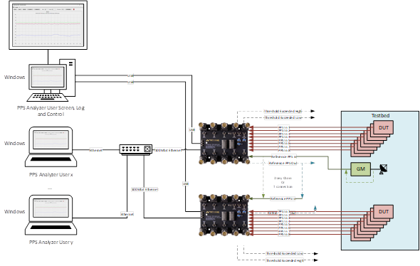
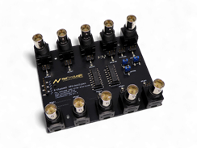

# UniversalPpsAnalyzer

## Product Brief

The PPS Analyzer is specifically designed for Plugfests where multiple devices are synchronizing each other, and the accuracy of the individual devices shall be measured via PPS (offset from reference PPS).

The device has 8 PPS inputs that are measured simultaneously, and it synchronizes itself to an additional reference PPS input.

Additionally, it has a PPS output of the synchronized clock which is used for PPS measurement or cascading of multiple PPS Analyzers.

Multiple PPS Analyzers can be connected to the same host and are all discovered automatically.

It uses a serial interface (mostly over USB) or Ethernet to access the PPS Analyzers.

---

| Key Features | Typical Applications |
|---|---|
| • 8 PPS inputs per analyzer | • Plugfests & Testbeds |
| • 1 reference PPS input per analyzer | • Long term measurements |
| • 1 PPS output per analyzer | • Verification |
| • Synchronized Clock via PPS | • Lab |
| • Timestamp resolution 1ns TDC |  |
| • UART or Ethernet connection |  |

---

# System Architecture

---

# Specification

|   |   |
|---|---|
| **Interfaces** | • 8 PPS inputs per analyzer • 1 PPS output per analyzer • 1 reference PPS input per analyzer • 2 configurable threshold signals to alarm when the offset exceeds a defined range • UART or Ethernet connection |
| **Measurement Features** | • Offset in nanoseconds of input PPS against reference PPS • Long term measurements (up to 100000 seconds with sliding screen window) • Enable, disable, rename individual PPS • Save screen as PNG, TIFF or BMP • Log values as CSV (infinite) • Min, Max, Mean and Standard Deviation calculation • Python Script for measurements from a script or custom measurements |
| **Accuracy** | • Timestamp resolution is 1ns with TDC • Individual delay compensation per PPS (for cable length differences) • EEPROM for buffer delay compensation • PPS compensated for synchronization error introduced by the reference PPS |
| **Modularity** | • Multiple Analyzers supported (in the same Screen) • Multi User capable (Ethernet only) • Self-discovery of all Analyzers • Can be cascaded or parallel feed with the same reference PPS |

---

# Deliverables

|   |
|---|
| • Arduino Shield |
| • FPGA Bitstream for the Digilent ArtyA7-35T, A7-100T or ArtyS7-50 |
| • Windows & Linux Application (Open Source) |
| • Python Script |

---

# Related Products

|   |
|---|
| • [PPS Master/Slave](http://www.nettimelogic.com/pps-products.php) |
| • [Adjustable Clock](http://www.nettimelogic.com/clock-adjustable-clock.php) |
| • [Signal Timestamper](http://www.nettimelogic.com/clock-signal-timestamper.php) |

---

# Company Information

|  |  |
|---|---|
| **Company** | NetTimeLogic GmbH |
| **Website** | https://www.nettimelogic.com |
